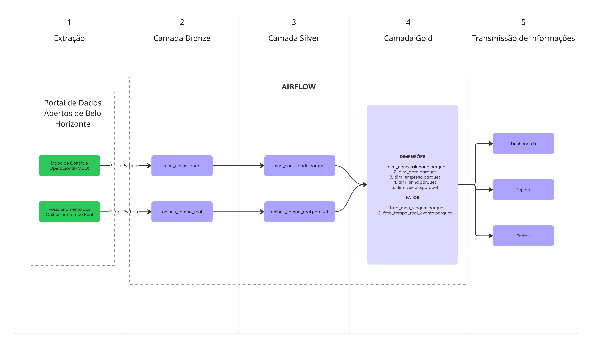

# Pipeline de Dados - Mobilidade Urbana (Belo Horizonte)

## Objetivos

Construir um pipeline de dados que:

1. Extraia dados públicos de mobilidade urbana;

2. Armazene os dados em um Data Lake;

3. Realize transformações e validações;

4. Carregue dados consolidados em um Data Warehouse para análise;

5. Siga boas práticas de DataOps, qualidade e governança.

## Estrutura do projeto

```
beanalytic-pipeline/
│
├── Data
│ ├── bronze/
│ │ 
│ ├── silver/
│ │ 
│ ├── gold/
|
├── src/
│ ├── ingest/
│ │ 
│ ├── transform/
│ │ 
│ ├── quality/
│ 
│
├── tests/
│ 
|
├── docs/ 
│ ├── data_dictionary_gold.md
| ├── architecture_diagram.jpg
|
|
├── Dockerfile
├── docker-compose.yml
├── requirements.txt
├── README.md
└── .gitignore
```  

## Desenvolvimento

* As dependências foram versionadas com intervalos compatíveis, priorizando estabilidade e reprodutibilidade do pipeline evitando impactos entre versões maiores.
* Incremental - As tabelas fato utilizam carga incremental por data_key,datas já processadas não são reprocessadas
* Pipeline preparado para execução diária via Airflow

## Camadas
* BRONZE
    - Item 1

* SILVER
    - Item 1

* GOLD 
    - A camada Gold foi modelada em formato estrela, com dimensões de data, linha,
concessionária, empresa e veículo, além de duas tabelas fato: uma para viagens
operacionais (MCO) e outra para eventos de posição em tempo real. As tabelas fato
suportam carga incremental baseada em data, estando prontas para consumo analítico
em ferramentas de BI ou consultas SQL.


## Diagrama de Arquitetura




\___________________________________

Desenvolvedor:  
Rodrigo Faustino ([linkedIn](https://www.linkedin.com/in/rodrigofaustino-/))   
Engenheiro de Dados | BI  