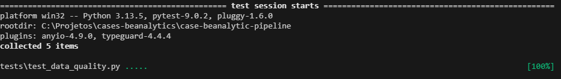

# Pipeline de Dados - Mobilidade Urbana (Belo Horizonte)

## Objetivos

Construir um pipeline de dados que:

1. Extraia dados públicos de mobilidade urbana;

2. Armazene os dados em um Data Lake;

3. Realize transformações e validações;

4. Carregue dados consolidados em um Data Warehouse para análise;

5. Siga boas práticas de DataOps, qualidade e governança.

## Estrutura do projeto

```
beanalytic-pipeline/
│
├── Data
│ ├── bronze/
│ │ 
│ ├── silver/
│ │ 
│ ├── gold/
|
├── src/
│ ├── ingest/
│ │ 
│ ├── transform/
│ 
│
├── tests/
│ ├── test_data_quality.py
│ 
├── docs/ 
│ ├── img/
│ ├── data_dictionary_gold.md
| ├── architecture_diagram.jpg
|
|
├── Dockerfile
├── requirements.txt
├── README.md
├── .gitignore
└── run_pipeline.py

```  

## Desenvolvimento

* As dependências foram versionadas com intervalos compatíveis, priorizando estabilidade e reprodutibilidade do pipeline evitando impactos entre versões maiores.
* Incremental - As tabelas fato utilizam carga incremental por data_key,datas já processadas não são reprocessadas
* Pipeline preparado para execução diária via Airflow
* O diagrama de arquitetura está na pasta docs/


## Diagrama de Arquitetura


## Instruções de execução

Requisitos básicos para executar a pipeline:
* docker instalado
* python

Execução:

1. clonar o repositório:
```
git clone https://github.com/RodrigoFaustin0/case-beanalytic-pipeline.git
```
2. baixar a imagem docker ou executar o build
```
docker build --no-cache -t be-pepiline .
```
3. Executar o container docker  

```
docker run -v ${PWD}/data:/app/data be-pepiline
```
4. Após esses passos, os arquivos serão salvos em 

```
bronze - silver - gold
```

## Testes de qualidade

1. Executar o seguinte comando

```
docker run --rm -v ${PWD}/data:/app/data be-pipeline pytest -q
```

2. Que terá como retorno




\___________________________________

Desenvolvedor:  
Rodrigo Faustino ([linkedIn](https://www.linkedin.com/in/rodrigofaustino-/))   
Engenheiro de Dados | BI  