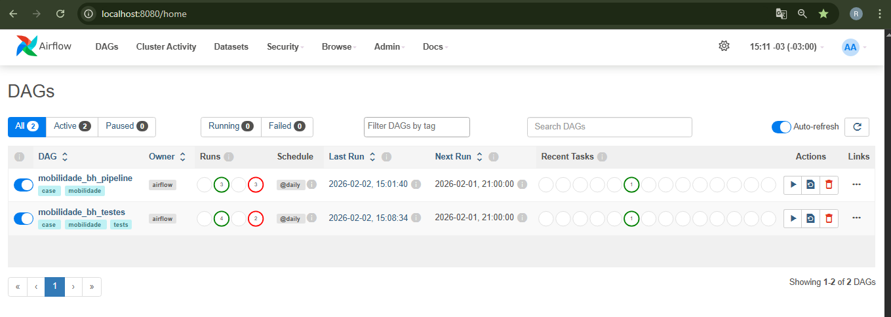
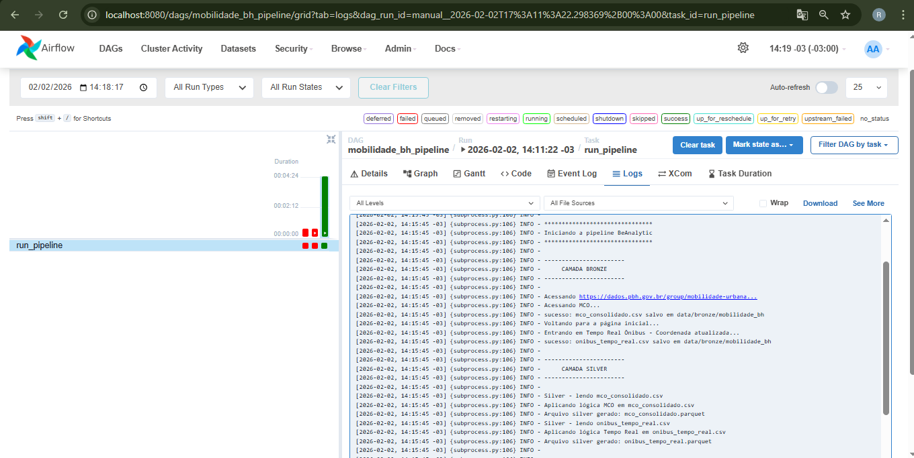
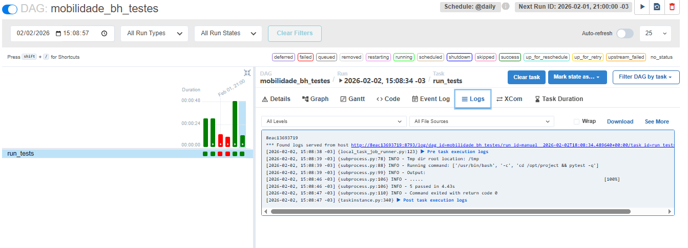

# Pipeline de Dados - Mobilidade Urbana (Belo Horizonte)

## Objetivos

Construir um pipeline de dados que:

1. Extraia dados públicos de mobilidade urbana;

2. Armazene os dados em um Data Lake;

3. Realize transformações e validações;

4. Carregue dados consolidados em um Data Warehouse para análise;

5. Siga boas práticas de DataOps, qualidade e governança.

## Estrutura do projeto

```
beanalytic-pipeline/
│
├── airflow
│ ├── dags/
│ ├── Dockerfile
│ ├── docker-compose.yml
|
|
├── Data
│ ├── bronze/
│ ├── silver/
│ ├── gold/
|
|
├── src/
│ ├── ingest/
│ ├── transform/
│ 
│
├── tests/
│ ├── test_data_quality.py
│ 
├── docs/ 
│ ├── img/
│ ├── data_dictionary_gold.md
| ├── architecture_diagram.jpg
|
|
├── requirements.txt
├── requirements-dev.txt
├── README.md
├── .gitignore
└── run_pipeline.py

```  

## Desenvolvimento

* As dependências foram versionadas com intervalos compatíveis, priorizando estabilidade e reprodutibilidade do pipeline evitando impactos entre versões maiores.
* Incremental - As tabelas fato utilizam carga incremental por data_key, datas já processadas não são reprocessadas
* Pipeline preparado para execução diária via Airflow


## Diagrama de Arquitetura


## Dicionário de dados (Gold)


[data_dictionary_gold.md](docs/data_dictionary_gold.md)


## Instruções de execução

Requisitos básicos para executar a pipeline:
* Docker
* Python 3.11+
* Git

Execução:

1. clonar o repositório:
```
git clone https://github.com/RodrigoFaustin0/case-beanalytic-pipeline.git
```
2. Acessar a pasta airflow 
```
cd airflow
```
3. Executar
```
docker-compose up -d
```
4. Aguardar subir os serviços e depois acessar

```
localhost:8080 
```
5. Espere alguns minutos para o host ser carregado, e pronto, você terá acesso ao página inicial do Airflow, as credenciais são (login:admin e senha:admin).

    

6. A partir daí, terá a DAGs 'mobilidade_bh_pipeline' disponível para execução

7. Retorno da execução

    


## Testes de qualidade

1. Acessar o Airflow

```
localhost:8080
```

2. Executar a DAG 'mobilidade_bh_testes'

3. Retorno da execução

    
    ## Melhorias futuras

* Incluir Minio para armazenar os dados  


\_ _ _ _ _ _ _ _ _ _ _ _ _ _ _ _ _ _

Desenvolvedor:  
Rodrigo Faustino ([linkedIn](https://www.linkedin.com/in/rodrigofaustino-/))   
Engenheiro de Dados | BI  
